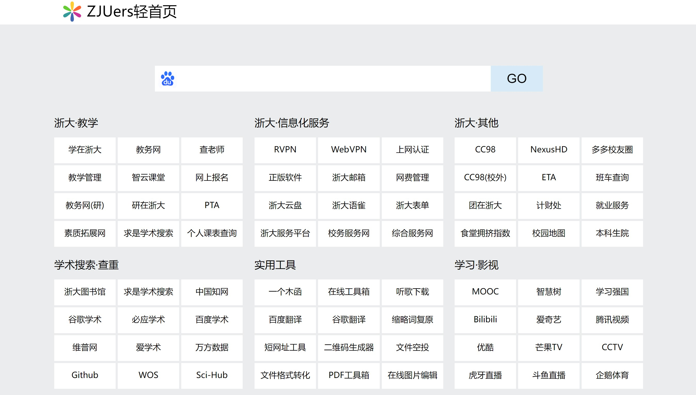

# ZJUers Home Page

*This project is only used as an exercise for my own static website learning. I borrowed from a very popular browser homepage in the school:https://zjuers.com/

## Involved content

It only involves the basic html and css that I have learned during this time, and does not involve other content such as js.

## Show results

## Disadvantages and deficiencies

Since the project does not use JavaScript, the function of modifying the search engine of the original website has not been implemented, and the color model has not been created, and the link points to the color model of the original website.